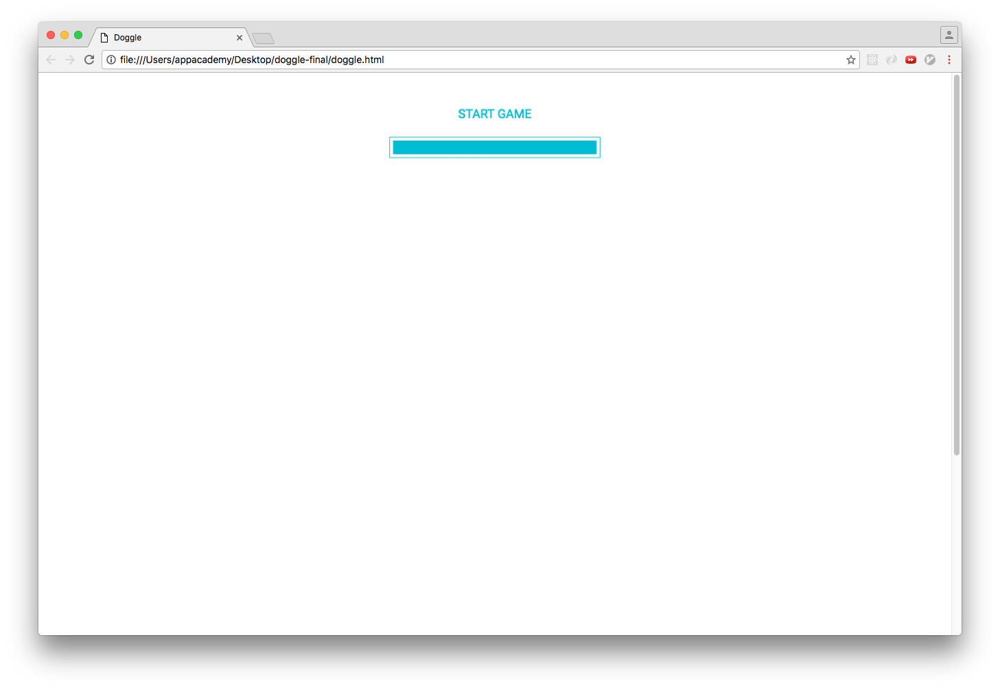
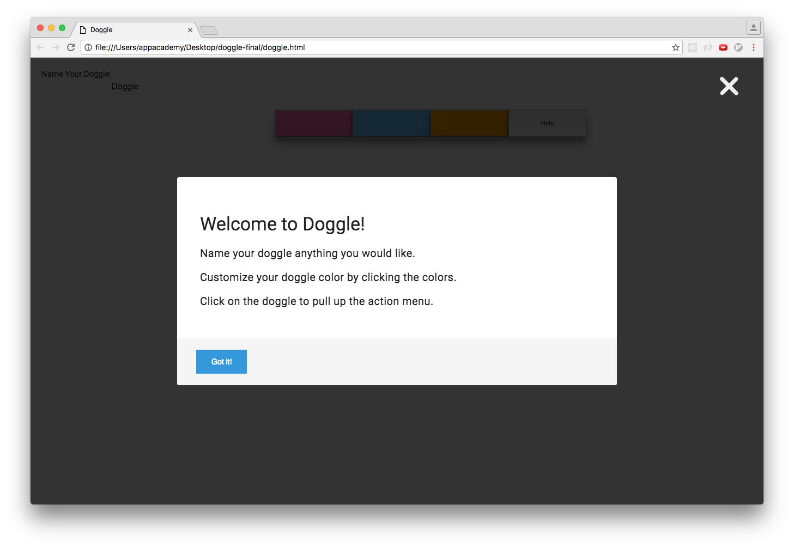
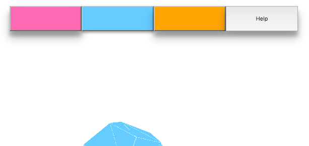

# Doggle

## Doggle: An Interactive Pet Game

### Background

This game is inspired by Nintendog, Tamagotchi, and similar pet simulations. The player interacts with a minimalistic 3d pet called a Doggle. The player can rename their pet and click on help button for explanation of controls.

### Architecture and Technologies

This project was implemented with the following technologies:

- ES6 and Babel, with npm for package managment.
- Vanilla JavaScript and jQuery for the menu overhead.
- CreateJs (Easel.js, Preload.js) and Three.js for background rendering, preloading images and loading bar, and 3d image for the doggle.
- Tingle modal for simple and visually pleasing modal.
- Webpack to bundle and serve up the various scripts.

### Preloading Images

This project utilizes the PreloadJS library in the CreateJS suite to preload potential large files for Doggle interactions.

### Modal Help Screen

This project has a modal for displaying the help dialogue.

### Customization

This project allows renaming the Doggle pet and picking the desired color.

